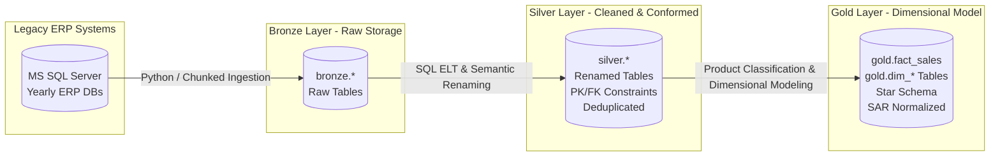
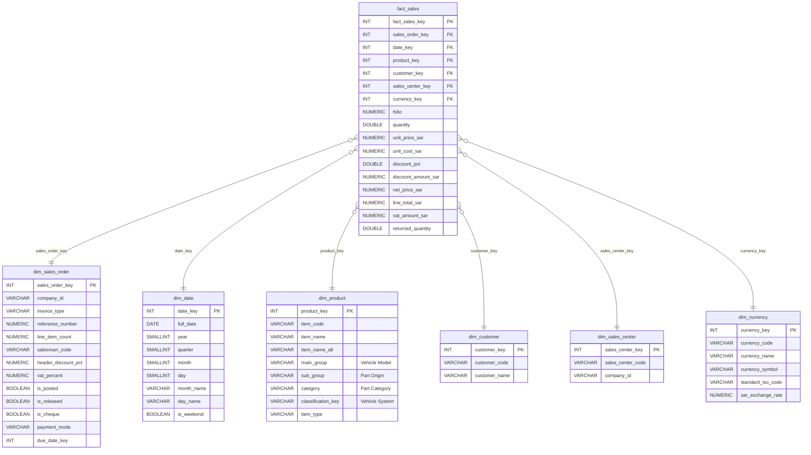

# 🚗 Automotive Sales Data Warehouse & ELT Pipeline

A production-grade, enterprise Data Warehouse and ELT (Extract, Load, Transform) data pipeline built on **PostgreSQL** using the **Medallion Architecture (Bronze ➔ Silver ➔ Gold)**. 

The project consolidates and models multi-year automotive spare parts sales data from legacy Microsoft SQL Server ERP systems into a business-ready **Star Schema** with normalized SAR (Saudi Riyal) pricing, advanced vehicle part categorization, customer segmentation, and market basket analytics.

---

## 🏗️ Architecture Overview



---

## 📑 Medallion Architecture Details

### 🥉 1. Bronze Layer (Raw Ingestion)
* **Purpose**: Ingests raw, unaltered tables from historical SQL Server ERP instances (`dbc01y21` – `dbc02y25`).
* **Technology**: Python (`pyodbc` + `psycopg2` batch streaming) / `pgloader`.
* **Key Scripts**:
  * [`01. bronze_layer/ingest_mssql_to_postgres.py`](01.%20bronze_layer/ingest_mssql_to_postgres.py): Memory-efficient chunked batch streamer.
  * [`01. bronze_layer/bronze_layer_ddl.sql`](01.%20bronze_layer/bronze_layer_ddl.sql): DDL for raw staging tables.

### 🥈 2. Silver Layer (Cleaned & Conformed)
* **Purpose**: Applies semantic snake_case naming conventions, resolves duplicates, standardizes data types, and enforces native ERP relational constraints.
* **Key Features**:
  * Systematic column and table renaming across 54+ entities mapped via [`rename_map.json`](rename_map.json).
  * `DISTINCT ON` deduplication preserving the latest archive snapshots.
  * Native ERP Primary Key and Foreign Key constraints (applied as `NOT VALID` where appropriate to accommodate legacy orphaned rows).
* **Key Scripts**:
  * [`02. silver_layer/01_rename_and_load_silver.sql`](02.%20silver_layer/01_rename_and_load_silver.sql)
  * [`02. silver_layer/02_native_silver_constraints.sql`](02.%20silver_layer/02_native_silver_constraints.sql)

### 🥇 3. Gold Layer (Star Schema & Business Analytics)
* **Purpose**: Pure Kimball-style Dimensional Model optimized for BI tools (Power BI, Tableau) and high-performance SQL analytics.
* **Currency Normalization**: All prices, costs, and discounts are standardized to **SAR (Saudi Riyal)**:
  $$\text{Price}_{\text{SAR}} = \text{Price} \times \begin{cases} 0.002421307506053 & \text{if Currency} = \text{'01' (YER)} \\ 3.8 & \text{if Currency} = \text{'02' (USD)} \\ 1.0 & \text{if Currency} = \text{'03' (SAR) or Local} \end{cases}$$
* **Product Catalog NLP / Text Classification**: Over 22,000 spare parts parsed by Arabic description and OEM part numbering conventions to classify:
  * **Vehicle Make & Model** (e.g. *Hyundai Elantra, Sonata, Accent, Tucson, Santa Fe, Kia Soul, Rio, Optima/K5...*)
  * **Origin / Quality** (*Genuine OEM, Korean [K], Chinese [C], Other*)
  * **Unified Part Category** (*Control Arm, Brake Pads, Sway Bar Link, Shock Absorbers...* unifying Left/Right and Front/Rear counterparts)
  * **Vehicle System** (*Suspension & Steering, Brake System, Engine & Mechanical, Cooling, Electrical, HVAC, Transmission, Body...*)

---

## 🌟 Gold Layer Star Schema Design



---

## 📊 Summary of Entities & Metrics

| Table | Layer | Role / Grain | Row Count | Description |
|---|---|---|---:|---|
| `gold.dim_date` | Gold | Date Dimension | 2,922 | Calendar dates from 2023-01-01 to 2030-12-31 |
| `gold.dim_product` | Gold | Product Dimension | 22,282 | Auto parts with Vehicle Model, Origin, Category & System |
| `gold.dim_customer` | Gold | Customer Dimension | 66 | Customer master records with business keys |
| `gold.dim_currency` | Gold | Currency Dimension | 4 | YER, USD, SAR, RMP with pegged SAR conversion rates |
| `gold.dim_sales_center` | Gold | Branch Dimension | 1 | Sales centers and operating company units |
| `gold.dim_sales_order` | Gold | Invoice Header Dimension | 1,894 | Order metadata, salesman, status, payment mode, basket size |
| `gold.fact_sales` | Gold | Line-Item Fact Table | 18,028 | Sales invoice line items with full SAR normalization |

---

## 📈 Sample Business & Analytics Queries

### 1. Market Basket Analysis (Items per Order & Basket Value)
```sql
SELECT 
    dso.payment_mode,
    COUNT(DISTINCT f.sales_order_key)                                                 AS total_orders,
    COUNT(f.fact_sales_key)                                                           AS total_items_sold,
    ROUND((COUNT(f.fact_sales_key)::numeric / COUNT(DISTINCT f.sales_order_key)), 2) AS avg_items_per_basket,
    ROUND((SUM(f.line_total_sar) / COUNT(DISTINCT f.sales_order_key)), 2)             AS avg_basket_value_sar,
    ROUND(SUM(f.line_total_sar), 2)                                                   AS total_revenue_sar
FROM gold.fact_sales f
JOIN gold.dim_sales_order dso ON f.sales_order_key = dso.sales_order_key
GROUP BY dso.payment_mode
ORDER BY total_revenue_sar DESC;
```

### 2. Top Revenue by Vehicle Make & Model
```sql
SELECT 
    dp.main_group AS vehicle_model,
    COUNT(f.fact_sales_key) AS items_sold,
    ROUND(SUM(f.line_total_sar), 2) AS total_revenue_sar,
    ROUND(AVG(f.unit_price_sar), 2) AS avg_unit_price_sar
FROM gold.fact_sales f
JOIN gold.dim_product dp ON f.product_key = dp.product_key
GROUP BY dp.main_group
ORDER BY total_revenue_sar DESC
LIMIT 10;
```

### 3. Sales Volume & Margin by Part Origin (Genuine vs. Aftermarket)
```sql
SELECT 
    dp.sub_group AS origin,
    COUNT(f.fact_sales_key) AS line_items_sold,
    ROUND(SUM(f.line_total_sar), 2) AS total_revenue_sar,
    ROUND(AVG(f.unit_price_sar), 2) AS avg_price_sar
FROM gold.fact_sales f
JOIN gold.dim_product dp ON f.product_key = dp.product_key
GROUP BY dp.sub_group
ORDER BY total_revenue_sar DESC;
```

---

## 🚀 Deployment & Execution Guide

### Prerequisites
* PostgreSQL 14+
* Python 3.10+ (with `psycopg2`, `pandas`, `pyodbc`)

### Execution Order
1. **Initialize Schemas**:
   ```sql
   \i create_schema.sql
   ```
2. **Deploy Bronze Layer**:
   ```sql
   \i 01. bronze_layer/bronze_layer_ddl.sql
   ```
3. **Deploy Silver Layer (Renaming & Native Constraints)**:
   ```sql
   \i 02. silver_layer/01_rename_and_load_silver.sql
   \i 02. silver_layer/02_native_silver_constraints.sql
   ```
4. **Deploy Gold Layer (Star Schema & Classification)**:
   ```sql
   \i 03. gold_layer/gold_layer_ddl.sql
   \i 03. gold_layer/gold_layer_load.sql
   ```

---

## 📂 Repository Structure

```
.
├── create_database.sql                 # Database creation
├── create_schema.sql                   # Medallion schemas setup (bronze, silver, gold)
├── rename_map.json                     # Semantic renaming mappings for 54+ tables
├── 01. bronze_layer/
│   ├── bronze_layer_ddl.sql            # Raw staging DDL
│   ├── ingest_mssql_to_postgres.py     # Batch data extractor from SQL Server
│   └── truncate_bronze.sql             # Staging cleanup
├── 02. silver_layer/
│   ├── 01_rename_and_load_silver.sql   # Silver ELT transform & load script
│   ├── 02_native_silver_constraints.sql# Native ERP PK/FK constraint definitions
│   └── silver_layer_ddl.sql            # Silver layer DDL
└── 03. gold_layer/
    ├── gold_layer_ddl.sql              # Star Schema DDL (Option 3: Header Dim + Line Fact)
    ├── gold_layer_load.sql             # Automated Gold ELT loader with product NLP classifier
    └── products.csv                    # Cleaned & classified product catalog (22k+ items)
```

---

## 📄 License
This project is licensed under the MIT License - see the [LICENSE](LICENSE) file for details.
